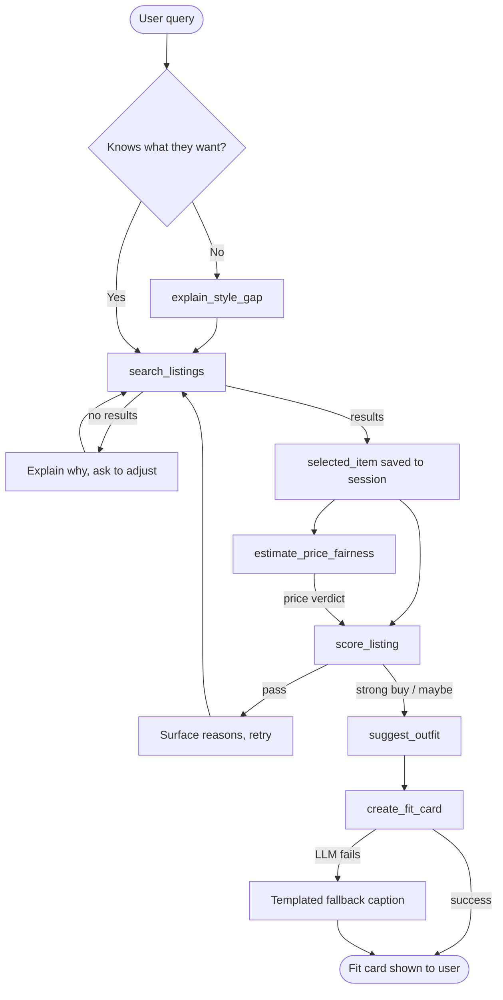

# FitFindr 🛍️

**An AI shopping agent that turns a plain-English request into a scored, styled, ready-to-post thrift find.**

Type something like *"vintage graphic tee under $30"* and FitFindr searches a secondhand listings dataset, checks whether the price is actually fair against comparable items, scores the buy against your existing wardrobe, builds a complete outfit around it, and writes a shareable outfit caption — all through one conditional tool-calling loop, no manual re-entry of data between steps.

[**Live demo →**](#) &nbsp;·&nbsp; Built with Python, Gradio, and Groq (LPU inference)

---

## Why this project

Most "chatbot wrapper" projects call an LLM once and print the response. FitFindr is an actual **agent**: it plans a sequence of tool calls, branches on what each tool returns, carries state forward so nothing is ever re-asked of the user, and degrades gracefully — every tool has a defined failure mode with no unhandled exceptions anywhere in the loop. That planning/state/error-handling discipline is documented in full in the [Technical Deep Dive](#technical-deep-dive) below.

## What it does

| Step | Tool | What happens |
|---|---|---|
| 1 | `explain_style_gap` *(optional)* | If the user doesn't know what they want, analyze their wardrobe for gaps and generate a search query for them |
| 2 | `search_listings` | Rank a 40-item mock listings dataset by keyword, size, and price fit |
| 3 | `estimate_price_fairness` | Compare the top result against real comparables in the dataset — "great deal," "fair price," or "overpriced" |
| 4 | `score_listing` | Score the item 0–10 against the user's wardrobe and style preferences, with a plain-English "strong buy / maybe / pass" verdict |
| 5 | `suggest_outfit` | Build 1–2 complete outfits pairing the new item with existing wardrobe pieces |
| 6 | `create_fit_card` | Generate a casual, Instagram-ready caption for the finished look |

A `"pass"` verdict sends the agent back to search automatically (up to 3 retries) instead of pushing a bad purchase forward through the rest of the pipeline.

## Tech stack

- **Python** — core agent logic, regex-based query parsing, planning loop
- **Groq API** (`openai/gpt-oss-120b`) — LPU-accelerated inference for outfit suggestions and caption generation
- **Gradio** — web UI
- **Pytest** — test suite for tool-level and agent-level behavior
- **Render** — deployment

## Architecture



Full state-flow, per-tool failure modes, and a step-by-step walkthrough of a real query are in the [Technical Deep Dive](#technical-deep-dive).

## Running locally

```bash
git clone https://github.com/anamgiri91/fitfindr.git
cd fitfindr
pip install -r requirements.txt
cp .env.example .env        # then add your Groq API key
python app.py
```

Open the localhost URL Gradio prints (usually `http://localhost:7860`).

Get a free Groq API key at [console.groq.com](https://console.groq.com).

## Deploying on Render

This repo includes a `render.yaml` blueprint, so deployment is a couple of clicks:

1. Push this repo to your own GitHub account.
2. In Render, choose **New → Blueprint** and point it at the repo. Render reads `render.yaml` and provisions the web service automatically.
3. When prompted, set the `GROQ_API_KEY` environment variable to your own key (marked `sync: false` in the blueprint so it's never committed).
4. Deploy. Render builds with `pip install -r requirements.txt` and starts the app with `python app.py`, which binds to `0.0.0.0` on Render's injected `$PORT`.

No Blueprint access? Create the web service manually with the same build/start commands and add `GROQ_API_KEY` under the service's **Environment** tab.

## Testing

```bash
pytest tests.py -v
```

Covers filtering edge cases in `search_listings` (size-exhausted, price-exhausted, no keyword overlap), empty-wardrobe behavior in `suggest_outfit` and `score_listing`, the templated fallback path in `create_fit_card`, and the "not enough data" branch in `estimate_price_fairness`.

## Project structure

```
fitfindr/
├── app.py                 # Gradio UI + query handler
├── agent.py                # Planning loop, session state, query parsing
├── tools.py                 # The 6 tools (search, price, score, outfit, caption, gap analysis)
├── utils/data_loader.py    # Listings + wardrobe schema loaders
├── data/
│   ├── listings.json        # Mock secondhand listings dataset
│   └── wardrobe_schema.json
├── tests.py
├── render.yaml              # Render deployment blueprint
└── planning.md              # Original design spec (tool contracts, error table, AI-assisted build log)
```

---

## Technical Deep Dive

<details>
<summary><strong>Full tool inventory, planning loop, state management, error handling table, and a step-by-step example run</strong></summary>

### Tool Inventory

FitFindr uses six tools. All three required tools plus three supporting tools are wired through a single planning loop.

---

#### `search_listings(description, size, max_price)`

**Purpose:** Searches `data/listings.json` for items matching the user's query. Filters by size and price ceiling, then ranks remaining items by keyword overlap with the description.

**Inputs:**
- `description` (str) — keywords describing the item (e.g. `"vintage graphic tee"`)
- `size` (str | None) — size string to filter by, case-insensitive; `None` skips size filtering
- `max_price` (float | None) — maximum price inclusive; `None` skips price filtering

**Returns:** `list[dict]` — a list of matching listing dicts sorted by relevance score (highest first). Each dict contains: `id`, `title`, `description`, `category`, `style_tags` (list), `size`, `condition`, `price` (float), `colors` (list), `brand`, `platform`. Returns an empty list if nothing matches — never raises an exception.

---

#### `suggest_outfit(new_item, wardrobe)`

**Purpose:** Given the item the user is considering and their existing wardrobe, generates 1–2 complete outfit combinations by matching style tags and complementary colors. Falls back to general styling advice when the wardrobe is empty.

**Inputs:**
- `new_item` (dict) — a single listing dict returned by `search_listings`
- `wardrobe` (dict) — the user's wardrobe with an `items` key containing a list of wardrobe item dicts; may be empty

**Returns:** `str` — a non-empty string with 1–2 outfit suggestions. If the wardrobe has items, suggestions name specific wardrobe pieces and explain why they work together. If the wardrobe is empty, the string gives general styling advice for the item's vibe and occasion.

---

#### `create_fit_card(outfit, new_item)`

**Purpose:** Takes the outfit suggestion string and the listing dict and generates a 2–4 sentence Instagram/TikTok-style caption that sounds like a real person posting an OOTD — not a product listing.

**Inputs:**
- `outfit` (str) — the outfit suggestion string returned by `suggest_outfit`
- `new_item` (dict) — the listing dict for the thrifted item being featured

**Returns:** `str` — a casual, shareable caption that mentions the item name, price, and platform once each and captures the outfit's specific vibe. If `outfit` is empty or missing, returns a descriptive error string instead of raising an exception.

---

#### `score_listing(item, wardrobe, style_profile)`

**Purpose:** Scores a listing 0–10 based on how much value it adds to the wardrobe. Evaluates style tag overlap, category redundancy, item condition, and style profile preferences to give a buy confidence verdict.

**Inputs:**
- `item` (dict) — a single listing dict from `search_listings`
- `wardrobe` (dict) — the user's current wardrobe with an `items` key
- `style_profile` (dict | None) — optional user preferences: `preferred_colors`, `style_tags`, `avoided_categories`

**Returns:** `dict` with:
- `score` (float) — buy confidence from 0–10
- `reasons` (list[str]) — plain-English strings explaining what raised or lowered the score
- `verdict` (str) — one of `"strong buy"`, `"maybe"`, or `"pass"`
- `low_confidence` (bool) — `True` if the wardrobe was empty and the score is a partial estimate

---

#### `estimate_price_fairness(item, condition_weight)`

**Purpose:** Scans the dataset for comparable listings (same category, at least one shared style tag) and estimates whether the item's price is a deal, fair, or overpriced relative to real comparables.

**Inputs:**
- `item` (dict) — a single listing dict from `search_listings`
- `condition_weight` (float) — 0–1 value controlling how much condition affects the estimate; defaults to `0.5`

**Returns:** `dict` with:
- `verdict` (str) — one of `"great deal"`, `"fair price"`, `"overpriced"`, or `"not enough data"`
- `average_comparable_price` (float) — mean price of comparable items used in the estimate
- `comparables_found` (int) — number of matching items used
- `reasoning` (str) — plain-English explanation (e.g. `"4 similar tops average $31 — this is priced at $22. Verdict: great deal."`)

---

#### `explain_style_gap(wardrobe)`

**Purpose:** Analyzes the user's wardrobe and identifies what's missing — by category, versatility tags, and color variety — then produces a ready-made search query the agent can pass directly into `search_listings`.

**Inputs:**
- `wardrobe` (dict) — the user's current wardrobe with an `items` key; handles empty wardrobes

**Returns:** `dict` with:
- `gaps` (list[str]) — plain-English descriptions of what's missing or underrepresented
- `category_counts` (dict) — maps each expected category to how many items the user owns
- `suggested_search` (str) — a ready-made description string to pass into `search_listings`

---

### Planning Loop

The agent follows a conditional sequence — each tool's output determines whether the next tool runs, is skipped, or triggers a retry. The loop does not call all tools unconditionally.

**Step 1 — Does the user have a specific item in mind?**
- Yes → skip `explain_style_gap`, call `search_listings` directly
- No → call `explain_style_gap` on the current wardrobe; use `suggested_search` from the result to populate the `search_listings` call

**Step 2 — `search_listings`**
- Returns results → save top result to `session["selected_item"]`, proceed to Step 3
- Returns empty list → agent tells the user specifically what caused the miss (size unavailable, over budget, or no keyword overlap) and asks them to adjust; loop restarts at Step 2

**Step 3 — `estimate_price_fairness` and `score_listing`**
- Both run on `selected_item`; the price verdict feeds into `score_listing` as a signal
- `verdict` is `"strong buy"` or `"maybe"` → proceed to Step 4
- `verdict` is `"pass"` → agent surfaces the specific reasons (e.g. redundancy, poor condition), offers a new search; loop restarts at Step 2

**Step 4 — `suggest_outfit`**
- Returns outfit string → save to `session["outfits"]`, proceed to Step 5
- Wardrobe is empty → tool returns general styling advice; agent proceeds to Step 5 and notes the wardrobe is empty

**Step 5 — `create_fit_card`**
- LLM generates caption → save to `session["fit_card"]`, present to user
- `outfit` string is empty → tool returns a descriptive error string; agent surfaces it rather than crashing

The agent knows it's done when `create_fit_card` returns a result and the user has been shown the fit card. It then asks if they'd like to search again or refine the current item.

---

### State Management

The agent maintains a single `session` dict that accumulates results as tools run. No tool ever re-asks the user for something a previous tool already returned.

```python
session = {
    "wardrobe":       None,   # loaded once at session start
    "style_profile":  None,   # loaded once at session start
    "search_results": [],     # populated by search_listings
    "selected_item":  None,   # top result, saved after search_listings
    "price_verdict":  None,   # populated by estimate_price_fairness
    "score_result":   None,   # populated by score_listing
    "outfits":        [],     # populated by suggest_outfit
    "fit_card":       None,   # populated by create_fit_card
    "error":          None,   # set if any tool fails unrecoverably
}
```

**How state flows between tools:**

- `explain_style_gap` reads `wardrobe`; its `suggested_search` output is passed directly as the `description` arg to `search_listings`
- `search_listings` writes its results list to `search_results`; the agent picks `results[0]` and writes it to `selected_item`
- `estimate_price_fairness` reads `selected_item`; writes its full result dict to `price_verdict`
- `score_listing` reads `selected_item`, `wardrobe`, `style_profile`, and `price_verdict`; writes its result to `score_result`
- `suggest_outfit` reads `selected_item` and `wardrobe`; writes the outfit string to `outfits`
- `create_fit_card` reads `outfits[0]` and `selected_item`; writes the caption to `fit_card`

The item returned by `search_listings` is the exact same dict passed into `suggest_outfit` and `create_fit_card` — the user never re-enters it. If a `"pass"` verdict is returned, the agent clears only `search_results`, `selected_item`, `price_verdict`, `score_result`, `outfits`, and `fit_card` and restarts from Step 2 with the rest of the session intact.

---

### Error Handling

| Tool | Failure mode | Agent response |
|------|-------------|----------------|
| `search_listings` | Returns empty list (size unavailable, over budget, or no keyword overlap) | Agent tells the user exactly which filter caused the miss and asks them to adjust size, price, or keywords. Does not proceed to scoring. |
| `suggest_outfit` | Wardrobe is empty (`wardrobe["items"]` is `[]`) | Tool returns general styling advice rather than crashing or returning an empty string. Agent notes the wardrobe is empty and proceeds to `create_fit_card`. |
| `create_fit_card` | `outfit` string is empty or `None` | Tool returns the string `"Couldn't generate a caption — no outfit suggestion was provided."` Agent surfaces this message in the fit card panel rather than raising an exception. |
| `score_listing` | Wardrobe is empty or `style_profile` is `None` | Tool scores on available fields only and sets `low_confidence: True`. Agent shows the score with a note that it's a partial estimate. |
| `estimate_price_fairness` | Fewer than 2 comparable items found | Returns `verdict: "not enough data"` with a plain-English explanation. Agent shows this honestly rather than omitting the price panel. |
| `explain_style_gap` | Wardrobe is empty | Returns a default starter gap list with sensible starter recommendations. Agent uses `suggested_search` from the result to begin searching without asking the user anything. |

---

### Complete Interaction Walkthrough

**User query:** `"I'm looking for a vintage graphic tee under $30. I mostly wear baggy jeans and chunky sneakers."`

**Step 1 — Planning check:** User named a specific item, so `explain_style_gap` is skipped. Agent calls `search_listings(description="vintage graphic tee", size=None, max_price=30.0)`. Dataset returns matching listings. Top result — Y2K Baby Tee, $18, Depop — is saved to `session["selected_item"]`.

**Step 2 — Price check:** Agent calls `estimate_price_fairness(item=selected_item)`. Finds comparable tops averaging $31. Returns `verdict: "great deal"`, saved to `session["price_verdict"]`.

**Step 3 — Score:** Agent calls `score_listing(item=selected_item, wardrobe=wardrobe, style_profile=None)`. Reads `price_verdict` from session. Finds 3 wardrobe items with overlapping style tags (`"y2k"`, `"vintage"`). Returns `score: 7.5`, `verdict: "maybe"`. Saved to `session["score_result"]`.

**Step 4 — Outfit:** Verdict is `"maybe"` so agent proceeds. Calls `suggest_outfit(new_item=selected_item, wardrobe=wardrobe)`. Generates two complete outfit combinations using the example wardrobe. Saved to `session["outfits"]`.

**Step 5 — Fit card:** Agent calls `create_fit_card(outfit=outfits[0], new_item=selected_item)`. LLM generates a casual caption mentioning the item name, $18 price, and Depop platform. Saved to `session["fit_card"]` and shown to the user.

At every step, the item dict flows forward through session state — the user never re-enters it.

---

### Build Notes: Spec vs. Implementation

**Where the spec paid off:** requiring `search_listings` to return an empty list rather than raise an exception on no results shaped the entire error-handling architecture. Because the tool contract guaranteed a safe return value, the planning loop could check `if not results` cleanly rather than wrapping every call in try/except.

**Where the implementation diverged:** the original spec described `create_fit_card` returning a dict with `caption`, `tags`, and `title` fields. In practice, the UI needed a single string it could drop directly into a text panel, so the implementation was simplified to return just the caption string — generating and immediately discarding structured JSON added latency and parsing complexity for no user-visible benefit.

</details>

---

### License

Built as a personal/portfolio project. Feel free to fork and adapt.
